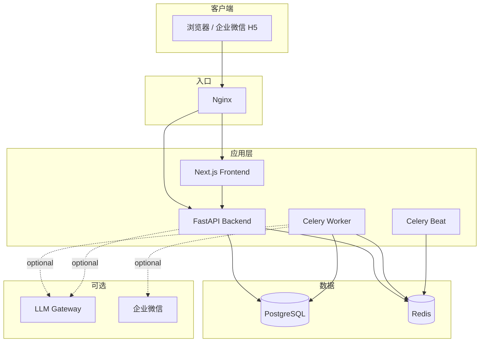

# AI 项目管理 Agent

[](LICENSE)

面向多行业团队的**轻量级 AI 项目管理 Agent**：软件、硬件、运营、咨询、制造等场景均可使用，不绑定单一行业。

成员维护「任务 / 负责人 / 完成时间 / 一句话进展」，系统负责进度跟踪、提醒、延期判断、风险识别、Issue、AI 总结、方案建议、管理层看板与自然语言查询。

**核心原则**：业务事实由 PostgreSQL + Backend 决定；AI 只做理解、总结、风险提示与自然语言查询。

**版权所有**：Jack Zhang（`59841153z@gmail.com` / `598411539@qq.com`）  
**开源协议**： [Apache License 2.0](LICENSE) — 详见 [NOTICE](NOTICE)。**版权人署名不得删除或替换。**

完整手册：[docs/HANDBOOK.md](docs/HANDBOOK.md)  
Agent Skills（Claude Code / Cursor / Codex）：[mcp/](mcp/README.md)

---

## 架构概览



## 技术栈

| 层 | 技术 |
| --- | --- |
| 前端 | Next.js · React · TypeScript · Ant Design |
| 后端 | Python 3.12+ · FastAPI · SQLAlchemy 2 · Pydantic 2 · Alembic |
| 数据 | PostgreSQL · Redis |
| 异步 | Celery Worker / Beat |
| AI | OpenAI 兼容网关（未配置时 Stub） |
| 部署 | Docker Compose · Nginx |

## 快速开始

```bash
cp .env.example .env   # 填写本地密钥；勿提交 .env
docker compose up -d --build
docker compose ps
```

浏览器访问 Nginx 入口（默认 `http://localhost`）。健康检查：`/health`、`/health/ready`。

本地开发、运维、安全与助手说明见 **[docs/HANDBOOK.md](docs/HANDBOOK.md)**。

```bash
make help
make env && make install
make up-infra && make migrate && make seed
```

## 目录结构

```text
.
├── LICENSE / NOTICE / COPYRIGHT
├── README.md
├── docs/HANDBOOK.md
├── mcp/skills/          # Cursor / Claude Code / Codex skills
├── backend/app/
├── frontend/
├── deploy/nginx/
├── docker-compose.yml
├── .env.example
└── Makefile
```

## 安全提示

- 切勿将 `LLM_API_KEY`、数据库口令、OA 口令、内网地址写入公开仓库。
- 生产环境必须更换 `JWT_SECRET` 与数据库密码。
- Seed 演示账号仅用于本地；共享环境请设置 `SEED_*_PASSWORD`。

## 贡献

欢迎 Issue 与 PR。贡献默认按 Apache 2.0 授权。请保留 `NOTICE` 中的版权人 **Jack Zhang**。

## License

Copyright 2024–2026 Jack Zhang  

Licensed under the Apache License, Version 2.0. See [LICENSE](LICENSE) and [NOTICE](NOTICE).
