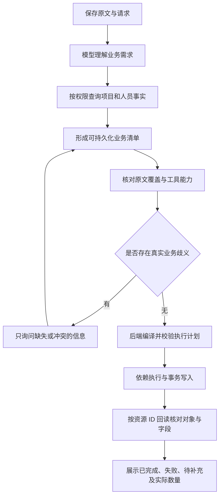

# 项目助手修复方案与验收清单

Copyright 2024–2026 Jack Zhang. Licensed under the Apache License, Version 2.0.
保留仓库 `LICENSE`、`NOTICE` 与版权归属。

日期：2026-09-14  
状态：P0／P1／R08 与可自动化 P2 项已完成；真实模型 24+1 评估与正式发版仍待人工门槛。  
验收操作清单：[ASSISTANT_ACCEPTANCE.md](ASSISTANT_ACCEPTANCE.md)。  
适用基线：当前 0.2.2 工作区及助手修复改动。  
总项目文档：[HANDBOOK.md](HANDBOOK.md)。正式版本变更记录只放在 `docs/releases/`。

## 1. 修复目标与边界

用户以自然语言、Markdown、表格、JSON 文本或混合排版提出需求，助手直接理解业务内容。用户不需要整理固定模板、提供内部字段名或修复模型生成的工具参数。

完整链路必须回答三个问题：用户要求什么；系统准备执行什么；实际完成了什么。允许自由输入，不等于取消工具参数、权限、事务和业务约束。

必须保持的边界：

- 业务事实由数据库和后端业务服务决定；模型不能直接执行 SQL。
- 所有工具以当前用户身份执行，读写均受权限约束。
- 普通任务创建已有明确授权时可以执行，不新增通用的“再次确认”步骤。
- 发布计划、影响既有排期等操作继续走现有预览、核对、确认与执行流程。
- 模糊项目、同名人员、相互冲突的日期等真实歧义需要澄清；模型内部格式错误由系统处理。
- 保留用户原文；不静默删任务、丢字段、猜人员、把待定日期补成今天。
- 不将本次真实业务清单、姓名、项目编号、会话内容、密钥或数据库转储写入仓库。

本方案覆盖对话入口、上下文、规划、工具、执行器、持久化、前端反馈、测试和发布。图片、附件解析不因本文而自动成为已支持能力，应以现有输入通道能力为准。

## 2. 当前机制与已确认问题

### 2.1 当前执行链路

1. 保存用户消息和请求 ID，校验会话归属与生成槽位。
2. 组装当前消息、历史对话、摘要、记忆和绑定项目。
3. 使用意图启发式分流。普通对话可进入 AgentScope／旧版工具循环；创建、修改等请求优先进入独立的指令规划器。
4. 规划器只开放 `plan_commands`，要求模型一次提交包含查询和写入的完整计划；业务工具说明作为提示词提供。
5. 后端校验结构、依赖、原文映射及部分业务意图。失败后最多再生成一次完整计划。
6. 整份计划通过后，执行器才按依赖调用工具、解析引用并写入数据库。
7. 返回执行卡片；批量工具另提供写入核对结果。

### 2.2 问题清单

| ID | 优先级 | 代码证据 | 影响 |
| --- | --- | --- | --- |
| R01 | P0 | `schemas/agent_command.py` 的 `locate_source_span()`、`validate_coverage()` | 每个步骤必须引用连续原文；汇总散落姓名的辅助查询也会拦住整份计划 |
| R02 | P1 | `agents/command_agent.py` 仅开放 `PLAN_TOOL` | 查询事实之前就要规划后续引用，增加猜测结构和引用错误 |
| R03 | P1 | `agents/command_agent.py` 的 `range(2)` | 只有两次整体生成机会，单个错误也需重交长计划，预算与普通 Agent 分离 |
| R04 | P0 | `agents/management_tools.py` 的 `batch_create_tasks` 定义；`services/agent_batch.py` 构造 `TaskCreate` | 提示词要求保留协作人、周期、里程碑，但优先推荐工具不能完整传递这些语义 |
| R05 | P0 | `services/agent_batch.py` 的 `_verify_create()` | 主要对照模型提交的任务名称检查缺失、重复，未核对完整原始业务需求和所有字段 |
| R06 | P1 | `services/agent_entities.py` 的意图与授权启发式 | 自然语言表达影响路由；意图识别、授权与业务校验职责混合 |
| R07 | P1 | `services/agent_commands.py` 的 `format_execution()`、执行卡片 | 成功写入步骤数容易被理解为已创建任务数；未规划时也出现执行阶段说明 |
| R08 | P1 | 当前回归使用模拟 Gateway；有 HTTP 测试曾挂起；SQLite 限制专用批量执行 | 单元测试和容器健康不能证明真实模型到 PostgreSQL 的业务闭环正确 |

上次已处理的内容：顶层 `items` 合法 JSON 字符串解码、取消按编号／项目符号硬拆任务、规划期间心跳、部分中断收尾。以上内容需要保留回归覆盖，但不足以关闭 R01–R08。

`owners 的原文映射不匹配` 表示内部步骤 `item_id=owners` 的引用校验失败，不表示负责人不存在。没有读取对应请求保存的候选计划时，不应推断模型实际提交的引用文本。

## 3. 目标架构

普通对话与批量指令共享受控查询能力、预算、错误协议和权限入口；批量写入继续使用持久化执行器。无需为了统一推理而删除事务、幂等、执行凭据或恢复机制。

### 3.1 原文与内部业务清单

新增或明确一个与输入排版无关的内部需求结构。以下为建议字段，不是要求用户填写的表单，也不是当前已存在的接口：

| 字段 | 说明 |
| --- | --- |
| `request_id`、`revision` | 服务端分配的请求关联与修订版本 |
| `requirement_id` | 业务条目的稳定标识，由服务端分配或登记后固定 |
| `kind` | 项目、任务、里程碑、关系、修改操作等明确对象类型 |
| `operation` | 创建、修改等动作，与对象类型分离 |
| `project_ref` | 绑定项目、已解析项目或待澄清候选，不由模型猜 ID |
| `fields` | 名称、人员、日期、工期、阶段、依赖及对象关系 |
| `field_state` | 区分已提供、明确待定、未提供、冲突；更新时区分“不修改”与“清空” |
| `evidence_refs` | 多个消息／原文片段引用，可覆盖不连续的来源 |
| `resolution` | 人员或项目解析状态、候选与查询证据 |
| `execution_refs` | 关联执行步骤及最终资源 ID |

业务条目与执行步骤允许一对多、多对一：查找一次人员可以服务多项任务；一次批量创建可以落实多项需求。阶段标题不自动创建任务；项目里程碑按里程碑对象处理。

### 3.2 原文引用与授权分离

- 原文引用用于解释和追溯，不作为所有辅助查询必须满足的连续字符串门槛。
- 来源可以是当前消息、授权范围内的历史消息、绑定项目或已成功的工具查询结果；每种来源应明确记录。
- 片段偏移由后端定位，模型不必计算字符坐标。多处姓名允许引用多个片段。
- 引用无法定位时标记为未解析证据，先进行定向修复或语义核对；不能把引用错误直接转成“用户需要重新整理输入”。
- 不能因为放宽引用就允许任意写入。新增／修改的对象、字段、取值及范围必须能解释为用户授权的需求；权限和必要确认在执行前再次校验。
- 外部工具返回文本属于数据，不得被当成新的用户授权。

### 3.3 先查询事实，再准备写入

规划阶段允许执行白名单只读工具，如项目查询、批量人员查询。结果携带对象 ID、查询范围及唯一／不存在／有歧义状态。

已有会话绑定优先作为“该项目”的确定上下文；无绑定时结合历史和查询结果解析。多个可访问候选时询问用户，不能直接采用最近返回的第一条。

明确的姓名唯一匹配才绑定账号；“待定”保留未指派。同名、不存在应只影响相关需求，并遵循用户选择的事务范围。不要为了绕过阻塞自动更换负责人或事务策略。

模型提交业务对象与真实查询结果的关联，后端根据已登记结果生成执行依赖，减少要求模型提前编写脆弱 `$ref` 路径。

### 3.4 字段与工具能力闭环

建立一份共享的字段契约，工具 Schema、业务服务、页面 API 和验收回读使用一致的语义。

| 业务信息 | 目标行为 |
| --- | --- |
| 任务名称 | 原意保留；禁止因内部编号要求强迫用户改名 |
| 负责人 | 唯一账号或明确未指派 |
| 协作人员 | 仅在用户明确区分协作人/协助人时写入 COLLABORATOR；未区分时一律按负责人（可多人） |
| 开始／截止日期 | 已知值准确保存；未知值保持未知，校验日期先后 |
| 计划周期 | 对接 `planned_duration_days`；明确自然日／工作日语义，不能擅自推算未知截止日期 |
| 阶段 | 明确 `work_stream` 与正式分组模型的边界；不要混同为可执行任务 |
| 里程碑 | 使用专用对象和关联，不默认为普通任务或仅保存为标题 |
| 依赖关系 | 引用真实对象，校验环与跨项目约束 |

普通创建工具、批量创建工具、计划草案路径必须有明确的能力矩阵。模型提出工具无法承载的字段时应返回结构化能力错误并选择可支持的合法路径；没有支持路径时显示未完成字段，禁止返回完整成功。

未知工具参数默认严格校验。只做有边界的兼容，例如某个应为数组的字段被编码成合法 JSON 字符串时解码一次，再执行原有校验；禁止 `eval`、循环解码、静默丢字段或将非法内容转换为空列表。

### 3.5 核对完整性

写入前：

1. 对完整原文与业务清单做语义核对，列出遗漏对象、遗漏字段、额外动作和相互冲突的信息。
2. 核对可以使用独立的模型审查轮次，但不能把模型的 `complete=true` 当成绝对证明。
3. 后端确定性检查清单到执行步骤的覆盖关系、字段可承载性和权限；真实歧义才交给用户。
4. 用户明确提出的数量和范围属于业务约束，不以正则统计编号、项目符号或标题作为任务数量真值。

写入后：

1. 按写入凭据中的资源 ID 回读数据库，核对项目归属及资源类型。
2. 对比实际名称、负责人、协作关系、日期、周期、阶段、里程碑及依赖。
3. 归一化必须有明确规则，例如日期格式；不得以模糊名称匹配替代身份核对。
4. 区分任务数、里程碑数、工具步骤数，返回逐项差异与结果。
5. 已提交但回读失败时标记待核实，不能宣布成功，也不能直接重写。未提交事务内的校验失败按事务策略回滚。

## 4. 错误恢复、状态与接口

### 4.1 局部修复与预算

修复错误条目及受影响的依赖，不要求模型反复重新生成全部长清单。每次修改绑定 `revision`；执行过的步骤和资源凭据不可被模型补丁覆盖。

预算同时限制总耗时、模型调用次数和相同错误重复次数，区分理解、查询、审查、修复与执行耗时。取消写死两次整体生成，但不能变成无限重试或单纯放大超时。

### 4.2 状态建议

保留现有请求／消息／执行计划状态的兼容读取。建议新增细分 `phase`，而不是未经评估直接更换全部枚举：

`理解需求 → 查询事实 → 核对清单 → 等待补充（可选） → 执行 → 回读核对 → 终态`

停止、异常、模型超时和正常结束都必须保存终态。规划和查询等待期间持续提交心跳；任务仍存活与请求已超时必须可区分。

继续遵循当前离页停止策略。停止只阻止尚未开始的操作；已经提交的写入必须保留并展示。不得将网络重连解释为新业务授权。若以后改成离页后台运行，需另行定义产品行为和任务所有权。

### 4.3 幂等与恢复

- `client_request_id` 管请求级重放；业务条目 ID、操作 ID 和执行凭据管写入恢复。
- 同一请求重复提交应重放结果；同一操作恢复不得重建成功对象。
- 新请求中可能与既有对象重复时，按业务规则核对，不用“同名即同对象”自动合并。
- 中断后先核对真实资源状态，再恢复未完成项；不能只按最后一次模型文字推断结果。
- 历史失败计划保留可读诊断；不得在升级后自动重放历史创建请求。

### 4.4 前端与错误协议

错误至少区分模型输出、引用诊断、能力不足、真实歧义、权限、业务约束、执行失败和结果待核实。错误对象关联需求 ID／步骤 ID、阶段及可恢复方式。

用户文案应说明业务影响，例如“人员核对尚未完成，任务尚未创建”；开发诊断保留 `owners` 等内部字段，但不将其直接当作用户需要修复的输入问题。

规划阶段展示真实进度，不显示“独立项继续”等执行提示。成功卡片显示实际任务数、里程碑数、未指派数量和字段差异；工具步骤数仅作为执行详情。

## 5. 分阶段实施清单

所有复选框表示未来交付项，未实施前不得勾选。阶段完成需满足对应验收，不以服务健康代替业务验收。

### P0：解除错误阻断，防止字段静默丢失

- [x] R01：辅助查询解除连续原文硬门槛，补多片段证据与写入授权回归。
- [x] R04：建立字段能力矩阵；不支持字段必须显式失败，随后补齐存储与工具传递。
- [x] R05：按资源 ID 回读，验证任务类型、项目归属及完整字段。
- [x] R07：区分模型错误与用户缺信息，按对象数量展示结果。
- [x] 为每个问题增加稳定复现用例；不能只删除原失败测试。

> P0 说明：协作人写入 `task_participants`（COLLABORATOR）；未区分角色时多人一律按负责人写入（主键 `owner_id` + 共同负责人 `OWNER`）。`batch_create_tasks` 接受 `tasks` 作为 `items` 别名；明确校验失败标 `FAILED`（`UNKNOWN` 仅用于中断未决）。里程碑与依赖仍显式 `CAPABILITY_UNSUPPORTED`。真实模型→PostgreSQL 闭环验收仍属 P2。

### P1：调整规划与恢复机制

- [x] R02：提供受控只读查询阶段，真实查询结果进入规划上下文。
- [x] R03：引入稳定业务清单、版本化局部修复和统一预算。
- [x] R06：将意图识别用于选择路径，授权与工具权限单独执行；弱确认和状态追问不得误写。
- [x] 对齐普通 Agent 与指令路径的错误、预算、取消及可观测协议。
- [x] 补齐重连、取消、进程退出、部分成功和结果待核实的恢复处理。

> P1 说明：规划阶段开放只读查询 + `plan_commands`；`planning_details` 含 facts／budget／requirements／recovery。停止、断连与过期回收会调用 `reconcile_after_interrupt`：PLANNING→失败可还原原文，RUNNING→PAUSED/PARTIAL，进行中项标 UNKNOWN。卡片区分待核实与可恢复项。

### P2：真实链路验收与发布

- [x] R08：排查现有 HTTP 测试挂起原因，恢复必需的接口回归。
- [x] 使用隔离 PostgreSQL／Redis 完成事务、并发、迁移、恢复测试。
- [ ] 使用实际配置的模型／网关完成脱敏业务语料评估。
- [ ] 完成灰度、数据库备份与恢复演练、旧版本读取兼容测试。
- [ ] 通过第 7 节发布门槛后才更新版本记录并部署。

> P2 说明：`COMMAND_PG_TESTS=1` 与 `REDIS_TESTS=1` 已在本环境跑通。脱敏夹具 `backend/evals/assistant_repair_24x1.yaml` 已就绪。`create_milestone` 已提供；`COMMAND_PLAN_ENABLED` 支持灰度。真实模型评估与生产备份／发版仍须按 [ASSISTANT_ACCEPTANCE.md](ASSISTANT_ACCEPTANCE.md) 人工执行，通过前不得 bump 版本号。

## 6. 涉及模块与交付物

下列相对路径均基于仓库根目录；新增文件名由实现阶段按现有组织方式确定。

| 模块 | 主要路径 | 交付物 |
| --- | --- | --- |
| 会话与上下文 | `backend/app/services/conversation.py`、`backend/app/agents/context_builder.py` | 原文、来源、阶段进度与恢复上下文 |
| 路由与实体解析 | `backend/app/agents/management_agent.py`、`backend/app/services/agent_entities.py` | 意图、权限、真实事实解析职责分离 |
| 规划协议 | `backend/app/agents/command_agent.py`、`backend/app/schemas/agent_command.py` | 内部业务清单、多片段证据、局部修复协议 |
| 执行器 | `backend/app/services/agent_commands.py` | 稳定依赖、修订控制、执行凭据与恢复 |
| 工具及批量写入 | `backend/app/agents/management_tools.py`、`backend/app/services/agent_batch.py` | 共享字段契约、能力矩阵、完整回读验证 |
| 对象与关系 | `backend/app/models/`、`backend/app/schemas/task.py`、`backend/app/schemas/plan_draft.py`、`backend/alembic/versions/` | 协作关系等必要模型扩展、兼容迁移 |
| API 与界面 | `backend/app/api/v1/agent.py`、`frontend/types/agent.ts`、`frontend/app/agent/page.tsx`、`frontend/components/agent/CommandPlanCard.tsx` | 分阶段状态、真实数量、业务错误和恢复入口 |
| 回归与评估 | `backend/tests/test_command_planning_repair.py`、`backend/tests/test_command_planning_postgres.py`、`backend/evals/` | 确定性测试、真实数据库测试和模型评估记录 |

每个实现 PR 必须包含对应问题 ID、行为变化、验证证据、兼容影响及尚未覆盖的部分。业务数据不随 PR 提交。

## 7. 验收矩阵与发布门槛

### 7.1 标准脱敏场景

使用 `PRJ-1001` 和人工测试账号构造业务清单：24 个任务、1 个里程碑，四组任务数量分别为 7、6、5、6，另有里程碑分组。包含重复编号、跨条目人员、协作人、已知日期、部分日期、待定人员与 14／20／21／28 天周期。

期望对象数量和字段由人工定义的测试夹具给出，不由生产代码分析编号推算。不得复制真实客户清单或姓名。

| 场景 | 必须达到的结果 |
| --- | --- |
| Markdown、多行压成一行、自然段、表格、JSON 文本 | 等价业务语义产生相同对象和字段；无需用户重排 |
| 不连续姓名引用、合理辅助查询摘要 | 查询可执行；不会因连续引用失败阻断整份计划 |
| 模型引用或参数错误 | 内部定向修复，必要时明确失败；不要求用户修复内部 JSON |
| 顶层数组被字符串化 | 合法数组只解码一次；非法数据仍拒绝且零业务写入 |
| 正常完整创建 | 数据库有 24 个任务和 1 个里程碑；所有已提供字段及关系一致 |
| 不支持字段 | 显示能力缺口或走合法替代路径，不丢字段后声称成功 |
| 待定负责人、部分日期、已知工期 | 精确保留未知／已知状态，不猜日期和人员 |
| 同名人员、项目不明确、日期冲突 | 只澄清有关信息；未授权或冲突的操作不执行 |
| 越权、状态追问、只讨论、无效确认 | 不产生越权或未授权写入 |
| 模型遗漏条目、丢协作人、混淆里程碑 | 写前核对指出差异并修正，无法修正则不返回完整成功 |
| 数据库字段与计划不一致 | 回读报告具体差异；已提交结果进入核实，避免重复写入 |
| 同请求重放、局部重试、并发发送 | 不重复创建；不覆盖成功凭据或并发修订 |
| 模型无响应、取消、断连、进程退出 | 心跳、终态和业务凭据一致，可恢复且不长期假运行 |
| 原子／独立执行 | 符合明确的事务范围；不得静默切换策略 |
| 历史计划与旧卡片 | 可读；升级不自动重放、不丢原文和已提交结果 |

### 7.2 测试分层

1. 单元测试使用模拟模型，验证结构、路由、依赖、错误分支、字段映射及回读差异。
2. HTTP 测试验证消息到卡片、终态、重放和取消。必需测试挂起或被跳过不能算通过。
3. PostgreSQL／Redis 集成测试验证真实事务、锁、幂等、部分失败与迁移。SQLite 不替代专用批量执行验收。
4. 真实模型评估对每种输入排版至少运行 3 次，记录模型／网关配置标识、修复轮次、耗时和对象字段准确性。日志脱敏；评估只能证明采样表现，不能证明任意输入永远正确。
5. 发布门槛：必需自动化用例全部通过；固定评估样本无遗漏对象、丢字段、越权、重复写入或虚假成功。出现其中任一项即阻止发布并补复现用例。

健康检查、首页 200、TypeScript 编译通过和模拟模型测试通过，均不能单独证明本次业务问题已修复。

## 8. 可观测性、发布与回滚

### 8.1 可观测性

按请求记录阶段起止时间、模型轮次、错误分类、查询次数、业务条目数、执行步骤数、回读差异数量、心跳年龄及取消原因。

内部可追踪 `request_id → requirement_id → step_id → resource_id`。候选计划和原文属于受访问控制的数据，不能无差别输出到公共日志。面向用户只展示必要业务信息。

### 8.2 发布顺序

1. 固定发布代码版本、数据库版本、模型配置标识和验收报告；工作区改动需明确归属。
2. 如新增表或字段，先在隔离环境验证迁移与旧版本兼容；生产迁移前完成数据库备份及恢复验证，保持单一 Alembic head。
3. 先部署兼容的数据库与后端协议，再更新前端。后端、Worker、Scheduler 使用一致代码版本。
4. 引入可配置的新版规划路径开关，小范围启用；切换只影响新请求，进行中请求绑定原协议版本。
5. 观察实际业务结果、错误率、耗时和回读差异，再扩大范围。验证 Nginx 入口及应用依赖健康。
6. 正式发布时同步后端／前端版本号，更新 `docs/releases/对应版本.md` 和发布索引；不得提前把计划写为已完成的版本能力。

### 8.3 回滚与历史恢复

- 保留旧应用镜像和兼容的配置；必要时关闭新版入口并回退应用版本。
- 新增数据库结构优先采用向后兼容迁移。应用回滚不自动执行破坏性数据库降级。
- 数据库降级不等于撤销业务写入。已创建对象通过已有授权业务流程处理，不因回滚直接删除。
- 历史失败请求先检查计划状态、执行凭据和实际对象，再确定恢复方式；不根据“失败”标签假设零写入。
- 不自动重放用户的历史任务清单。普通已授权请求的显式恢复复用原执行范围；新增或变更范围仍遵循既有产品规则。

## 9. 完成定义

只有在以下条件同时满足后，才可将本项目修复标为完成：

- [x] 用户不因输入排版或辅助步骤原文引用失败被要求改写清单。
- [x] 查询、业务需求、授权、引用证据和执行结果职责清楚，字段端到端可保存。
- [ ] 24 任务＋1 里程碑标准场景及全部关键异常场景通过真实数据库和规定的模型评估。
- [x] 结果展示准确区分任务、里程碑、步骤及未完成字段；不存在“写入步骤成功即全部需求完成”的误导。
- [x] 重试、取消、部分成功、并发和回滚均有可核验的执行凭据。
- [x] 已知 HTTP 挂起问题闭环；必需测试没有通过排除来掩盖。
- [ ] 发布记录、迁移兼容说明、回滚方案与实际部署版本一致。

本文新增不改变运行中的业务代码、不执行迁移、不触发部署或历史任务重放。
