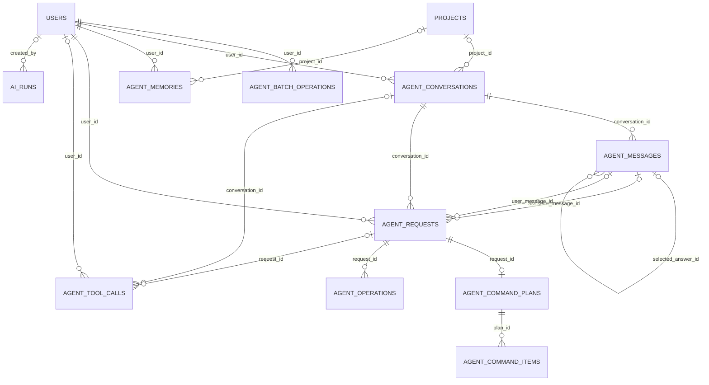
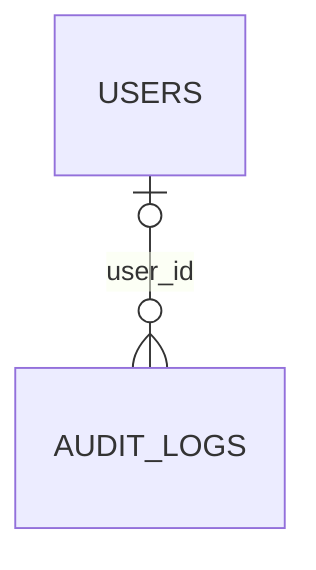
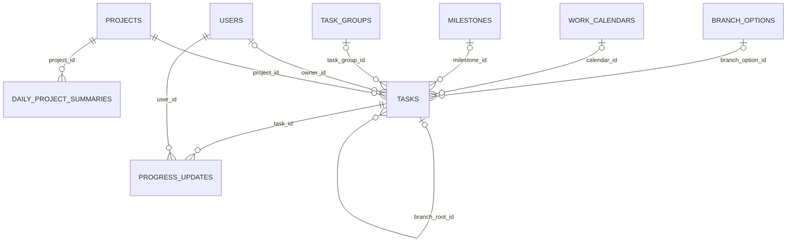
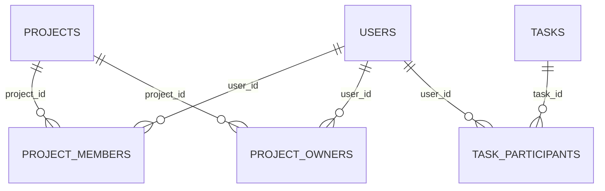
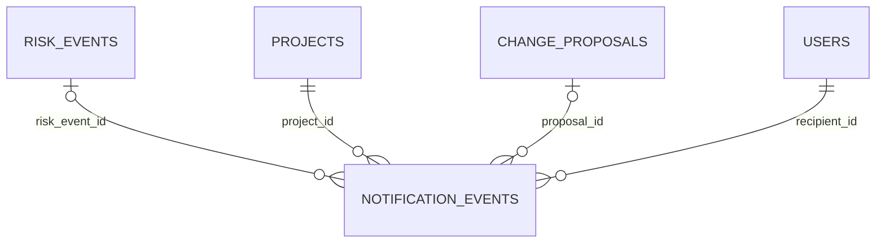
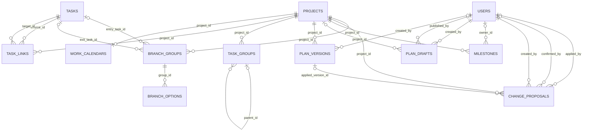
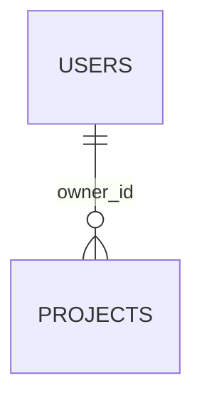
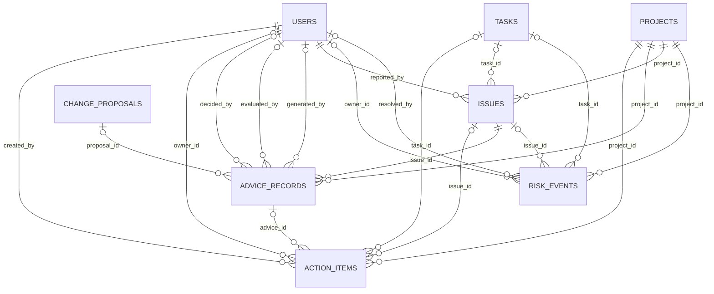

# DATABASE_ER

> Copyright 2024–2026 Jack Zhang. Apache License 2.0；保留 NOTICE 署名。
> 采集日期：2026-09-15；结构来源：实际 PostgreSQL 只读目录；业务语义来源：当前工作区模型、迁移与服务。
> 未读取业务记录。PUBLIC 仅表示字段可经授权业务 DTO 使用，不表示互联网公开或授权直连数据库。

仅绘制已确认的物理外键；推断关系见 DATABASE_RELATIONSHIPS。左端为被引用对象，右端为引用对象。o 表示可选，| 表示必须；FK 不保证父对象一定有子对象。为可读性按引用端所属模块分图，跨模块实体会重复出现。

## agent_runtime

## audit

## execution

## identity

## notification

## planning

## project_management

## risk

